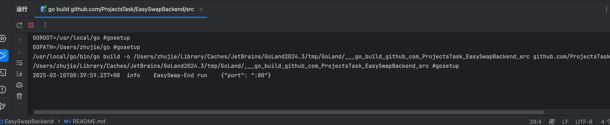

## EasySwap Web Server Backend project

## 如何运行项目

### 准备条件

1. 确保将下面三个 repo 都pull同一个本地目录
    - https://github.com/ProjectsTask/EasySwapBackend
    - https://github.com/ProjectsTask/EasySwapBase
    - https://github.com/ProjectsTask/EasySwapSync
    -- EasySwapBackend
    -- EasySwapBase
    -- EasySwapSync

2. 复制下配置文件 `cp config/config.toml.example  config/config.toml`

3. 打开 go.mod 这一行的注释，然后 终端执行 `go mod tidy`
```shell
replace github.com/ProjectsTask/EasySwapBase => ../EasySwapBase
```

3. infura 上面注册一个账号，给 `chain_supported.endpoint` 替换掉

4. 通过部署 https://github.com/ProjectsTask/EasySwapContract（看里面的README.md）得到订单簿合约的地址 替换掉 config/config.toml 中的 easyswap_market.contract 

5. docker 上面 运行一下 `EasySwapSync/docker-compose.yml` 给 redis 和 mysql 环境整好

6. 运行以下指令，如果你是 goland ide 你可以直接到 src/main.go 上面点击启动
   
```shell
cd src
go run main.go
```
如图：恭喜你后端 的api 服务运行成功了！

