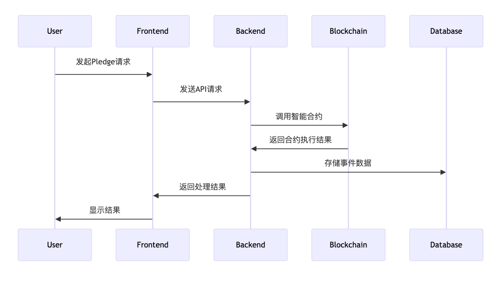

# 项目实战：pledge 后端部分需求清单

## Pledge 后端开发教程

[https://github.com/pledge-defi/pledge-backend](https://github.com/pledge-defi/pledge-backend)

## 为什么需要后端代码

### 1. 数据存储和管理

后端负责将用户的 Pledge 数据存储到数据库中，并提供数据管理功能。

### 2. 安全性

后端可以实现各种安全措施，例如用户认证、权限控制等，确保系统的安全性。

### 3. 业务逻辑处理

后端实现了复杂的业务逻辑，例如 Pledge 的计算、状态管理等，确保系统的正确性和可靠性。

### 4. 与区块链交互

后端代码负责与区块链上的智能合约进行交互，执行合约调用、事件监听等操作。

## 数据交互流程

### 1. 用户发起 Pledge 请求

用户在前端界面上发起 Pledge 请求，前端将请求发送到后端 API。

### 2. 后端处理请求

后端 API 接收到请求后，进行必要的验证和处理，然后调用智能合约的相关方法。

### 3. 智能合约执行

智能合约在区块链上执行 Pledge 操作，并生成相应的事件。

### 4. 事件监听

后端代码监听智能合约的事件，将事件数据存储到数据库中，并根据事件执行相应的业务逻辑。

### 5. 数据返回前端

后端将处理结果返回给前端，前端更新界面显示。



## Pledge 后端功能

### 1. 合约部署和绑定

后端代码负责与区块链上的智能合约进行交互，包括部署合约和生成合约绑定代码。例如，pledgePoolToken.go 文件中包含了部署 PledgePoolToken 合约的代码。

### 2. API 接口

后端提供 API 接口，供前端或其他服务调用。这些接口处理各种业务逻辑，例如用户的 Pledge 请求、查询 Pledge 状态等。

### 3. 数据库操作

后端代码与数据库交互，存储和检索与 Pledge 相关的数据。例如，用户的 Pledge 记录、合约事件等。

### 4. 定时任务

后端代码可以包含定时任务，用于定期执行某些操作，例如检查 Pledge 状态、处理到期的 Pledge 等。

### 5. 日志记录

后端代码记录系统运行日志，便于调试和监控系统状态。

### 1. 环境设置

#### 1.1 安装 Go 语言

首先，你需要安装 Go 语言。你可以从 Go 官方网站下载并安装最新版本的 Go。

#### 1.2 设置 Go 环境变量

安装完成后，设置 Go 的环境变量。你可以在终端中运行以下命令：

```
export GOPATH=$HOME/go
export PATH=$PATH:$GOPATH/bin
```

#### 1.3 安装依赖

在项目根目录下运行以下命令来安装项目所需的依赖：

`go mod tidy`

### 2. 项目结构

Pledge 后端项目的结构如下：

```go
Pledge 后端项目结构

pledge-backend/
├── api/                // 包含所有API相关的代码，例如HTTP处理程序
│   └── pledge_api.go   // 处理Pledge相关的API请求
├── config/             // 存放配置文件和配置管理代码
├── contract/           // 包含智能合约相关的代码
│   └── bindings/       // 存放由abigen生成的合约绑定代码
│       └── pledgePoolToken.go // PledgePoolToken合约的Go绑定代码
├── db/                 // 数据库相关的代码，例如数据库连接和操作
├── docs/               // 项目文档
├── log/                // 日志相关的代码和配置
├── schedule/           // 定时任务相关的代码
│   └── pledge_task.go  // 处理Pledge相关的定时任务
├── utils/              // 工具类代码，例如通用函数和帮助类
├── go.mod              // Go模块文件，定义项目依赖
├── go.sum              // Go模块的依赖版本锁定文件
└── README.md           // 项目简介和使用说明
```

### 详细说明

**api/**: 该目录包含所有 API 相关的代码，例如 HTTP 处理程序。pledge_api.go 文件处理 Pledge 相关的 API 请求。

**config/**: 该目录存放配置文件和配置管理代码。

**contract/**: 该目录包含智能合约相关的代码。

**bindings/**: 该子目录存放由 abigen 生成的合约绑定代码，例如 pledgePoolToken.go 文件。

**db/**: 该目录包含数据库相关的代码，例如数据库连接和操作。

**docs/**: 该目录存放项目文档。

**log/**: 该目录包含日志相关的代码和配置。

**schedule/**: 该目录包含定时任务相关的代码，例如 pledge_task.go 文件处理 Pledge 相关的定时任务。

**utils/**: 该目录包含工具类代码，例如通用函数和帮助类。

**go.mod**: Go 模块文件，定义项目依赖。

**go.sum**: Go 模块的依赖版本锁定文件。

**README.md**: 项目简介和使用说明。

1. 编写合约绑定代码

#### 3.1 生成合约绑定代码

使用 abigen 工具生成 Go 语言的合约绑定代码。假设你的合约 ABI 文件为 PledgePoolToken.abi，字节码文件为 PledgePoolToken.bin，运行以下命令：

```go
abigen --abi=PledgePoolToken.abi --bin=PledgePoolToken.bin --pkg=bindings --out=contract/bindings/pledgePoolToken.go
```

#### 3.2 合约绑定代码示例

以下是生成的 pledgePoolToken.go 文件的部分内容：

```go
// ... existing code ...

// DeployPledgePoolToken deploys a new Ethereum contract, binding an instance of PledgePoolToken to it.
func DeployPledgePoolToken(auth *bind.TransactOpts, backend bind.ContractBackend, _oracle common.Address, _swapRouter common.Address, _feeAddress common.Address) (common.Address, *types.Transaction, *PledgePoolToken, error) {
        parsed, err := PledgePoolTokenMetaData.GetAbi()
        if err != nil {
                return common.Address{}, nil, nil, err
        }
        if parsed == nil {
                return common.Address{}, nil, nil, errors.New("GetABI returned nil")
        }

        address, tx, contract, err := bind.DeployContract(auth, *parsed, common.FromHex(PledgePoolTokenBin), backend, _oracle, _swapRouter, _feeAddress)
        if err != nil {
                return common.Address{}, nil, nil, err
        }
        return address, tx, &PledgePoolToken{PledgePoolTokenCaller: PledgePoolTokenCaller{contract: contract}, PledgePoolTokenTransactor: PledgePoolTokenTransactor{contract: contract}, PledgePoolTokenFilterer: PledgePoolTokenFilterer{contract: contract}}, nil
}

// ... existing code ...
```

1. 编写 API

#### 4.1 创建 API 文件

在 api 目录下创建 pledge_api.go 文件，编写 API 逻辑。

#### 4.2 API 示例

以下是一个简单的 API 示例：

```go
package main

import (
        "log"
        "net/http"

        "github.com/gorilla/mux"
)

func main() {
        r := mux.NewRouter()
        r.HandleFunc("/api/pledge", PledgeHandler).Methods("POST")
        log.Fatal(http.ListenAndServe(":8000", r))
}

func PledgeHandler(w http.ResponseWriter, r *http.Request) {
        // 处理pledge请求的逻辑
        w.WriteHeader(http.StatusOK)
        w.Write([]byte("Pledge successful"))
}
```

1. 编写定时任务

#### 5.1 创建定时任务文件

在 schedule 目录下创建 pledge_task.go 文件，编写定时任务逻辑。

#### 5.2 定时任务示例

以下是一个简单的定时任务示例：

```go
package main

import (
        "log"
        "time"
)

func main() {
        for {
                log.Println("Running scheduled task...")
                // 定时任务逻辑
                time.Sleep(1 * time.Hour)
        }
}
```

### 部署

#### 6.1 构建项目

在项目根目录下运行以下命令来构建项目：

```go
go build -o pledge-backend
```

#### 6.2 运行项目

运行以下命令来启动 API 和定时任务：

```go
./pledge-backend
```

#### 测试

#### 7.1 编写测试用例

在 api 目录下创建测试文件 pledge_api_test.go，编写测试用例。

#### 7.2 测试示例

以下是一个简单的测试示例：

```go
package main

import (
        "net/http"
        "net/http/httptest"
        "testing"
)

func TestPledgeHandler(t *testing.T) {
        req, err := http.NewRequest("POST", "/api/pledge", nil)
        if err != nil {
                t.Fatal(err)
        }

        rr := httptest.NewRecorder()
        handler := http.HandlerFunc(PledgeHandler)
        handler.ServeHTTP(rr, req)

        if status := rr.Code; status != http.StatusOK {
                t.Errorf("handler returned wrong status code: got %v want %v", status, http.StatusOK)
        }

        expected := "Pledge successful"
        if rr.Body.String() != expected {
                t.Errorf("handler returned unexpected body: got %v want %v", rr.Body.String(), expected)
        }
}
```

作业：把后端程序跑起来，尝试里面的逻辑
