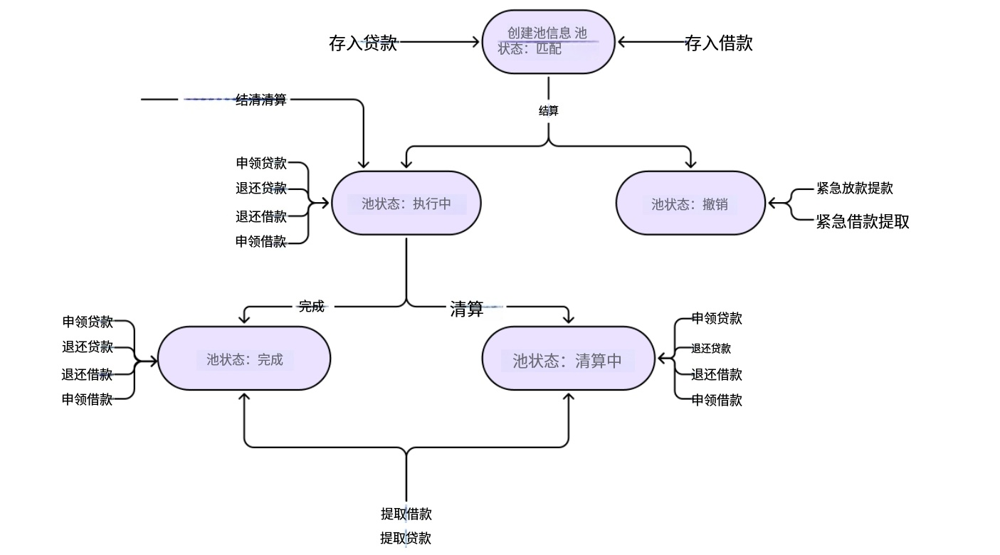
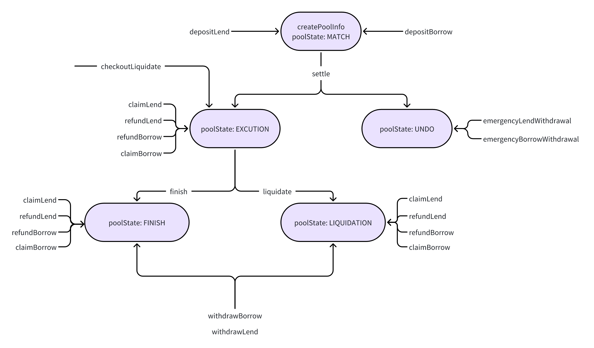

# [Pledge系统文档](https://github.com/MetaNodeAcademy/ProjectBreakdown-Pledge) :point_left: 
[Pledge前端代码](https://github.com/MetaNodeAcademy/ProjectBreakdown-Pledge/tree/main/pledge-fe) :point_left: 
[Pledge后端代码](https://github.com/MetaNodeAcademy/ProjectBreakdown-Pledge/tree/main/pledge-backend) :point_left: 
[Pledge合约代码](https://github.com/MetaNodeAcademy/ProjectBreakdown-Pledge/tree/main/pledgev2) :point_left: 
[Pledge合约视频教程](https://k22zz.xetlk.com/s/1kYAcz) :point_left: 
[Pledge后端视频教程](https://k22zz.xetlk.com/s/4bOGZv) :point_left: 

## :one:  系统概述
借贷是Defi领域非常重要的模块，Maker、Aave、Compound是当前借贷领域的三巨头。  
Maker: 抵押资产获取稳定币DAI  [详情](https://docs.makerdao.com/smart-contract-modules/dai-module)  
Aave: 加密货币借贷协议  [详情](https://aave.com/docs/developers/smart-contracts)  
Compound: 加密货币借贷协议  [详情](https://docs.compound.finance/#protocol-contracts)  
Pledge 是一个去中心化金融（DeFi）项目，旨在提供固定利率的借贷协议，主要服务于加密资产持有者。Pledge 旨在解决 DeFi 借贷市场中缺乏固定利率和固定期限融资产品的问题。传统的 DeFi 借贷协议通常采用可变利率，主要服务于短期交易者，而 Pledge 则专注于长期融资需求。以下是对 Pledge 项目的详细分析：

## :two:  功能需求
### 2.1 核心功能
- **固定利率借贷**: Pledge 提供固定利率的借贷服务，减少利率波动带来的风险。
- **去中心化 Dex 交易**(核心)。

### 2.2 主要角色
- **借款人**: 可以抵押加密资产以获得稳定币，用于投资非加密资产。
- **贷款人**: 提供流动性，获得固定回报。

### 2.3 关键组件
- **智能合约**: 自动执行借贷协议，确保交易记录上链且不可篡改。
- **pToken/jToken**: 代表未来时间点的价值转移，用于借贷和清算。

## :three:  代码分析
PledgePool.sol 是 Pledge 项目的核心智能合约之一，主要功能包括：
### 3.1 Pool
- **创建和管理借贷池**: 包括设置借贷池的基本信息、状态管理等。
- **用户存款和取款**: 处理用户的借款和贷款操作，包括存款、取款、索赔等。
- **自动清算**: 根据设定的阈值自动触发清算操作，保护借贷双方的利益。
- **费用管理**: 设置和管理借贷费用，确保平台的可持续运营。

    
  相关单词  
  pledge：质押   
  lend: 借给，借出；贷出   
  settle 结算： 买卖双方在交易达成后，实际完成资金和资产（或合约权利义务）的交付与转移的过程，从而使交易最终了结、风险终结。  
    

## :four:  事件和函数
- **事件**:如 DepositLend、RefundLend、ClaimLend 等，用于记录用户操作。
- **函数**: 如 DepositLend、refundLend、claimLend 等，实现具体的业务逻辑。

## 名词解释
### 相关知识
在 DeFi “借贷池”里，有两种主要角色：  
放贷的人（供应者）：把钱存进去赚利息（像 DepositLend）。  
借钱的人（借款者）：需要先“抵押”自己的加密货币作为担保，才能借走钱  

### DepositLend 
存款借贷  
你把钱（加密货币）存进“DeFi 银行”的借贷池，让别人可以借走，你赚利息。这一步就是“存款并开始放贷”。  
### refundLend 
退款借贷 / 撤回存款（部分或全部）  
如果你不想继续放贷了，想把钱拿回来（包括本金 + 已赚利息），就调用这个函数。“refund”在这里指“退回”你的供应资产  

### claimLend
领取借贷奖励 / 认领利息或额外奖励  
有时候利息不是自动加到本金里，而是单独累积成“奖励”，你需要手动点一下“领取”才能到账  

###Depositborrow
抵押存款以借款 / 存入抵押品来借钱。  
有些协议把“存抵押 + 借钱”合并成一个函数，便于用户一键操作，减少 gas 费  