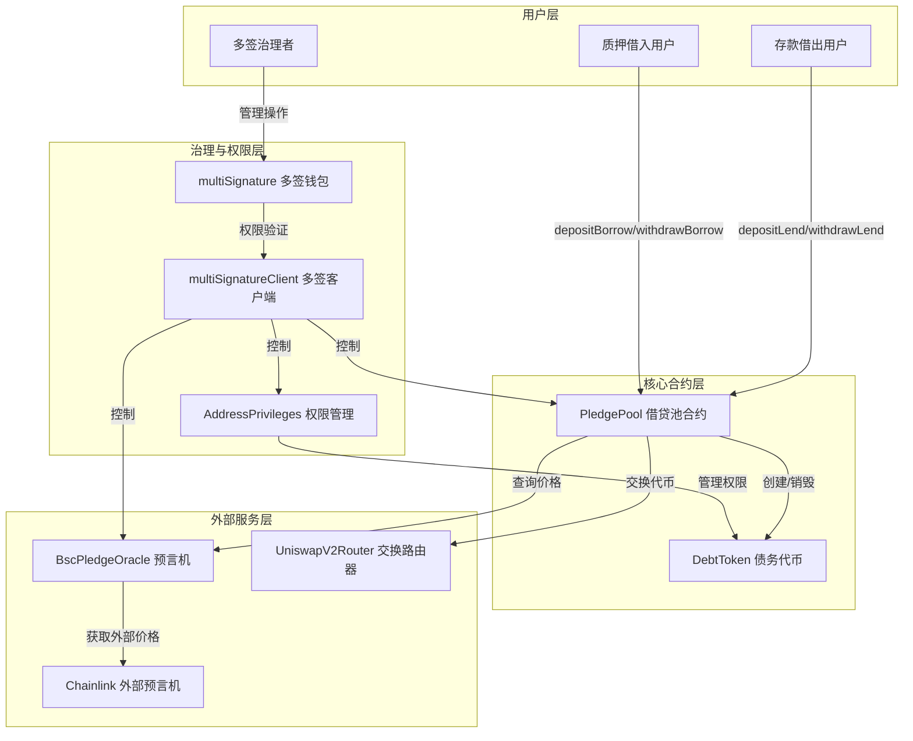

# PledgeV2 项目架构分析

## 项目概述

PledgeV2 是一个基于区块链技术的去中心化借贷质押平台，允许用户通过质押资产进行借贷操作，并提供自动清算机制确保系统安全。项目采用多签治理模式，确保关键操作的安全性和去中心化特性。

## 核心组件

### 1. 多签治理模块
- **multiSignature.sol**: 实现多签钱包功能，包括提案创建、签名验证和权限管理
- **multiSignatureClient.sol**: 提供多签权限验证客户端接口

### 2. 借贷核心模块
- **PledgePool.sol**: 核心借贷池合约，实现存款借出、质押借入、清算等主要功能
- **DebtToken.sol**: 债务代币合约，用于跟踪和管理借款方的债务

### 3. 辅助服务模块
- **BscPledgeOracle.sol**: 预言机合约，提供资产价格查询服务
- **AddressPrivileges.sol**: 地址权限管理合约，控制关键角色权限

## 系统架构图



## 质押率概念

质押率（Collateralization Ratio）是去中心化借贷平台中确保系统安全的核心概念，它代表了用户提供的抵押品价值与借入资产价值之间的比率关系。在PledgeV2项目中，质押率的计算直接影响借款额度和清算条件。

### 质押率计算公式
根据PledgeV2项目代码实现，**实际质押率计算方式**为：

**质押率 = 抵押品数量 × 抵押品价格 / 实际借款价值**

在`settle`函数中，项目通过以下逻辑实现质押率控制：
```solidity
// 计算总保证金价值
uint256 totalValue = pool.borrowSupply.mul(prices[1].mul(calDecimal).div(prices[0])).div(calDecimal);
// 计算实际可借款价值 = 总保证金价值 × (baseDecimal/martgageRate)
uint256 actualValue = totalValue.mul(baseDecimal).div(pool.martgageRate);
```

### 关键参数
- **抵押品价值**：通过预言机获取的抵押资产当前市场价值
- **借款债务价值**：借款本金加上累计利息的总债务价值
- **martgageRate**：借贷池中设定的抵押率参数，决定了抵押品可借额度的比例
- **autoLiquidateThreshold**：自动清算阈值，当抵押品价值低于该阈值时触发清算

### 清算触发逻辑
在`checkoutLiquidate`函数中，项目计算清算条件：
```solidity
// 计算当前抵押品价值
uint256 borrowValueNow = data.settleAmountBorrow.mul(prices[1].mul(calDecimal).div(prices[0])).div(calDecimal);
// 计算清算阈值 = settleAmountLend × (1 + autoLiquidateThreshold)
uint256 valueThreshold = data.settleAmountLend.mul(baseDecimal.add(pool.autoLiquidateThreshold)).div(baseDecimal);
// 当抵押品价值小于清算阈值时触发清算
return borrowValueNow < valueThreshold;
```

当抵押品价值低于清算阈值时，系统允许触发清算操作，保障借出资金安全。

### 安全阈值
- **健康阈值**：通常为150%-200%，当质押率低于此值时，系统提醒用户补充抵押品
- **清算阈值**：通常为120%-150%，当质押率低于此值时，任何人可触发清算流程

### 质押率监控机制
系统通过预言机实时获取资产价格，持续监控每个借款方的质押率状态，确保系统整体安全性。

## 核心流程详解

### 1. 借贷池创建流程
1. 多签治理者通过 multiSignature 合约创建新借贷池提案
2. 达到签名阈值后，提案执行，初始化 PledgePool 合约
3. 设置池参数（借款资产、抵押资产、利率、清算阈值等）

### 2. 存款借出流程
1. 用户调用 depositLend 存入借出资产
2. 系统计算份额并更新 LendInfo，铸造对应的份额凭证
3. 触发 DepositLend 事件

### 3. 质押借入流程
1. 用户调用 depositBorrow 存入质押资产
2. 系统根据当前资产价格和预设折扣率计算质押率
3. 基于质押率计算最大可借额度（确保质押率高于安全阈值）
4. 用户调用 withdrawBorrow 借出目标资产
5. 系统创建债务记录，铸造对应债务代币

### 4. Settle（结算）流程
**作用**：在达到预设结算时间后，将借贷池从匹配状态(MATCH)转换为执行状态(EXECUTION)，并计算实际有效的借贷金额

**详细步骤**：
1. 多签治理者或授权角色调用 settle 函数
2. 系统验证当前时间是否大于池子的结算时间(settleTime)
3. 验证池子状态必须为匹配状态(MATCH)
4. 如果池子存在有效借贷（lendSupply和borrowSupply均大于0）：
   - 获取借款资产和抵押资产的当前价格
   - 计算总保证金价值 = 保证金数量 × 保证金价格
   - 计算实际可借款价值 = 总保证金价值 × (baseDecimal/martgageRate)
   - 根据质押率约束，确定最终的settleAmountLend和settleAmountBorrow
   - 将池子状态更新为EXECUTION
5. 如果是极端情况（借款或借出任一为0）：
   - 将池子状态更新为UNDONE
   - 记录原始借贷金额
6. 触发状态变更事件

**关键机制**：
- 质押率控制：确保借款金额不超过抵押品价值的安全范围
- 时间限制：只能在预设结算时间后执行
- 状态转换：将池子从匹配阶段推进到执行阶段
- 极端情况处理：妥善处理借贷不平衡的情况

### 5. Finish（完成）流程
**作用**：在借贷池生命周期结束或特殊情况下，完成池的最终清算和关闭

**详细步骤**：
1. 多签治理者通过提案触发 finish 函数
2. 系统检查池状态和时间条件，确保可以进入完成阶段
3. 执行最终的 settle 操作，计算所有未结算利息
4. 锁定新的借贷操作，只允许提款和清算
5. 允许存款人提取所有本金和收益
6. 允许借款方偿还债务并取回抵押品
7. 当所有资产处理完毕后，池进入最终关闭状态

**触发条件**：
- 达到预设的借贷池结束时间
- 发生紧急情况需要关闭池
- 多签治理投票决定关闭池

### 6. Liquidate（清算）流程
**作用**：当池子中的抵押品价值低于清算阈值时，通过执行代币交换和费用计算，将借贷池状态从执行状态(EXECUTION)转换为清算状态(LIQUIDATION)，确保借出资金的回收

**详细步骤**：
1. 通过checkoutLiquidate函数检测到池子的抵押品价值低于清算阈值
2. 多签治理者或授权角色调用liquidate函数，传入池子ID
3. 系统验证当前时间大于结算时间(settleTime)
4. 验证池子状态必须为执行状态(EXECUTION)
5. 计算时间比率 = ((结束时间 - 结算时间) * 基础小数)/365天
6. 计算利息 = 时间比率 * 利率 * 结算贷款金额
7. 计算贷款金额 = 结算贷款金额 + 利息
8. 添加贷款费用，计算最终需要卖出的借款代币数量
9. 调用_sellExactAmount函数，执行代币交换操作（卖出借款代币，买入借出代币）
10. 处理交换后的金额：如果交换获得的借出代币多于贷款金额，收取相应费用
11. 计算剩余的借款金额，并收取借款费用
12. 更新池子状态为LIQUIDATION
13. 触发状态变更事件

**关键机制**：
- 时间约束：只能在结算时间后执行清算操作
- 状态验证：确保池子处于正确的执行状态
- 利息计算：基于时间加权的线性利率模型
- 费用收取：分别对贷款和借款方收取相应费用
- 代币交换：通过UniswapV2Router实现代币间的转换
- 清算阈值检查：通过checkoutLiquidate函数验证抵押品价值是否低于安全阈值

**清算触发条件**：
- 抵押品价值 = settleAmountBorrow × 抵押品价格
- 清算阈值 = settleAmountLend × (1 + autoLiquidateThreshold)
- 当抵押品价值 < 清算阈值时，触发清算条件

## 技术特点

1. **多签治理机制**: 关键操作需多方确认，提高安全性
2. **模块化设计**: 各功能组件分离，易于维护和升级
3. **自动化清算**: 基于预言机价格的自动清算机制
4. **事件驱动**: 全面的事件记录，便于外部系统监控
5. **安全性保障**: 继承 ReentrancyGuard 防止重入攻击，使用 SafeMath 避免整数溢出

## 部署架构

1. **合约部署**: 使用 Hardhat 开发环境，通过 scripts/deploy/ 目录下的脚本进行部署
2. **测试框架**: 完善的测试用例，确保核心功能正确性
3. **环境配置**: 通过 .env 文件管理部署参数和密钥

## 主要接口与交互

### 多签治理接口
- `createApplication(bytes memory data, string memory note)`: 创建治理提案
- `signApplication(uint256 applicationId)`: 签名提案
- `executeApplication(uint256 applicationId)`: 执行已通过的提案

### 借贷池核心接口
- `depositLend(uint256 amount)`: 存入借出资金
- `withdrawLend(uint256 share)`: 提取借出资金
- `depositBorrow(uint256 amount)`: 存入抵押资产
- `withdrawBorrow(uint256 amount)`: 提取借入资金
- `liquidate(address borrower)`: 清算违约借款

### 预言机接口
- `setPrices(address[] memory assets, uint256[] memory prices)`: 设置资产价格
- `getUnderlyingPrice(address asset)`: 获取资产价格

## 安全机制

1. **权限控制**: 所有关键操作均需经过多签验证
2. **状态验证**: 严格的池状态检查，确保操作在正确状态下执行
3. **时间锁**: 关键操作设有时间限制，防止突发攻击
4. **紧急暂停**: 支持全局暂停功能，应对紧急情况
5. **溢出保护**: 使用 SafeMath 库避免整数溢出问题

## 总结

PledgeV2 是一个功能完整的去中心化借贷平台，采用多签治理确保安全性，通过预言机获取价格信息，实现自动清算机制。系统架构清晰，模块化设计便于维护和扩展，各项安全机制完备，为用户提供安全可靠的借贷服务。